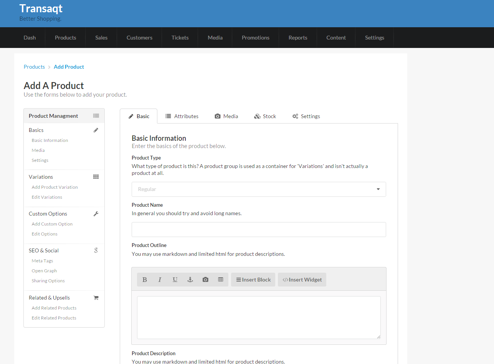

[](https://travis-ci.org/waxim/transaqt)

## Transaqt
Transaqt will be an shoping system with a killer back office, hopefully. This readme is more like a wishlist/note to remind me.

Here, have a screenshot.


# Pipeline
Things with a line though haven't been started.
- Mock Interface - __Progress:__ 10%
- Build Core - __Progress:__ 5%
- 100% Test Coverage - __Progress:__ 10%
- Docs - __Progress:__ 0.00001%
- ~~Build Module System~~
- ~~Build Core Modules~~
- ~~Integrations~~

## Features
- Allows people to buy stuff.

## Other less important features
- Stock Management
- Case Management
- Sensible Promotion Management
- Sensible Refunds and Exchanges
- i18n
- Sensible Content Manager
- Report Designer
- Full API
- Plugins and stuff
- MOTO and ProForma options.
- Subscriptions

## Intergrations
- PayPal (Including Here, with an app), Stripe, GoCardless, SagePay and others
- FedEx, UPS, DHL, Royal Mail, USPS
- MailChimp, Google Analytics, Segment.io, MailGun, SendGrid, Twillio

## Installation
There isn't really anything to install yet, but be a rebel.
```php
composer install
```

## Test
```php
phpunit
```

## Contributing
Send a pull request.
